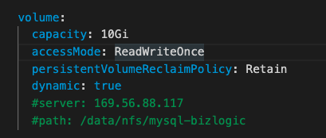
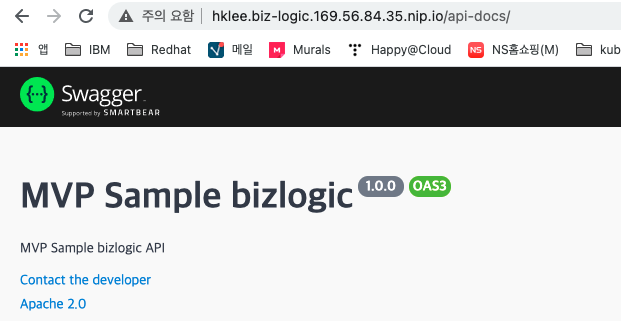

# mvp sample bizlogic
backend service sample입니다.   
아래와 같이 cluster에 배포하십시오.   


# 사전준비
- k8s cluster에 연결된 PC나 VM에 접근하십시오. 
- NFS Dynamic provisiong을 사용하려면, [NFS설치와 Dynamic provisiong설정](https://happycloud-lee.tistory.com/178?category=832243)을 참조하십시오. 
- [run-cicd 파이프라인](https://happycloud-lee.tistory.com/195?category=832250) 다운로드 
```
$ cd ~
$ git clone https://github.com/happyspringcloud/run-cicd.git
```
- namespace변수를 만듭니다. 아래 예 참조하여 적절히 변경하세요. 
```
$ export NS=mvp-sample
```

# git clone   
작업디렉토리를 만들고 git clone합니다.  
```
$ mkdir -p ~/work   
$ cd ~/work   
$ git clone https://github.com/happykube/mvp-sample-bizlogic.git
$ cd mvp-sample-bizlogic
```

# namespace 생성 & 현재 namespace 변경      
```
$ kubectl create ns ${NS}   
$ kubectl config set-context $(kubectl config current-context) --namespace ${NS}
```

# mysql db POD 배포   
- deploy/db-mysql/values.yaml수정 
  - storageClassName지정: kubectl get sc로 StorageClass를 찾아 적절한 SC를 지정
  - NFS dynamic provisioning사용 여부 지정: 사용 시 volume.dynamic에 true로 지정
  - dyamic provisioning 미사용시 NFS server, path 지정: volume.nfs.server, volume.nfs.path지정   
  - [예제]
  

- dyamic provisioning 미사용시 volume directory 작성   
  ```
  NFS서버로 접속하여, 아래 예제처럼 위에서 지정한 path를 생성   
  $ mkdir -p /data/nfs/mysql-bizlogic     
  $ chmod 777 /data/nfs/mysql-bizlogic   

  ```

- helm으로 mysql db 배포
```
$ cd ~/work/mvp-sample-bizlogic/deploy/db-mysql   
$ helm install mysql-bizlogic .   
$ kubectl get pod   
```

* 만약 다시 설치하려면 아래와 같이 지우고 재시도   
```
$ helm delete mysql-bizlogic   
```

# mvp-sample-bizlogic microservice 배포
- cicd디렉토리 하위의 cicd-common.properties, cicd-dev.properties, cicd-prod.properties파일 수정 

- run-cicd 실행하고, 값을 적절히 입력 
```
$ cd ~/work/mvp-sample-bizlogic
$ run-cicd
```

- PVC바인딩이 되어 있는지 확인
```
$ kubectl get pvc
```

- Pod실행여부 확인
```
$ kubectl get po
```

- Ingress주소로 웹브라우저에서 swagger page 확인
```
$ kubectl get ing
```
http://{ingress url}/api-docs으로 접근합니다.   


